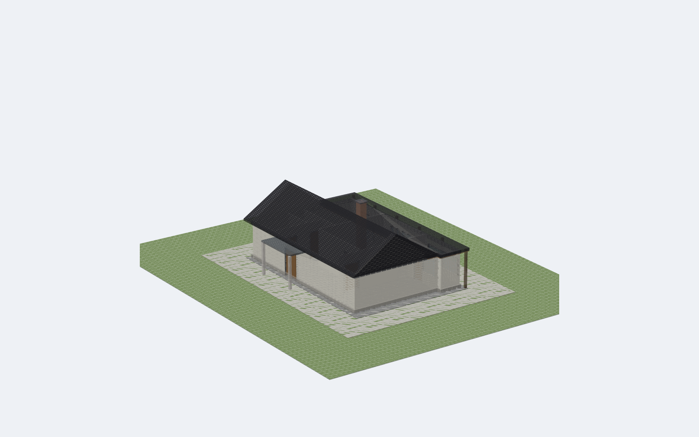
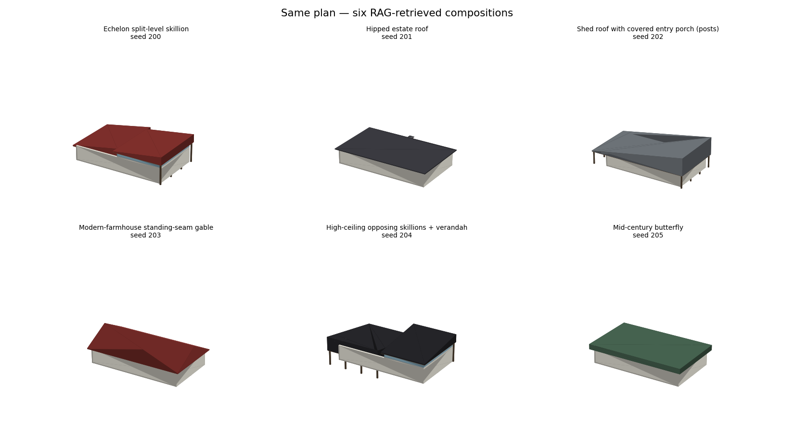

# Construct-AI — 2D floor plan → 3D house

Turns a flat floor-plan image into a complete, viewer-ready 3D building:
walls with real cut openings, framed doors and windows, a floor slab, site
context, and a generatively designed roof.



The interesting part is the roof. Most floor-plan-to-3D tools extrude walls
and drop a box on top. This one **retrieves a real architectural composition**
that fits the measured footprint — opposing skillions with a clerestory band,
a cross-gable with a portico, stacked modernist volumes — and executes it with
a geometry engine that guarantees the result is watertight and actually covers
the building.

---

## Pipeline

```
floorplan.png
   │
   ├─ 1. DETECT      YOLOv8 (best_doors.pt, CubiCasa5k-finetuned)
   │                 → wall / door / window boxes
   │                 detect.py snaps each opening to its nearest wall,
   │                 re-orients it along that wall's axis, drops strays
   │                 and merges YOLO's duplicate boxes
   │
   ├─ 2. SCALE       scale_utils.estimate_scale
   │                 per-plan px→metre scale: OCR of printed dimensions
   │                 when available, else long side → TARGET_LONG_M
   │                 ONE scale flows through every stage below
   │
   ├─ 3. DESIGN      roof_ai — decides WHAT roof (style, zones, materials)
   │                 roof_knowledge — the retrieval knowledge base
   │
   ├─ 4. GEOMETRY    roof_generator — decides HOW to build it
   │                 hip/valley surfaces from a distance field, so ridges
   │                 follow any L/T/U footprint; multi-zone composites
   │                 with height offsets, clerestory bands, porches, posts
   │
   └─ 5. ASSEMBLE    builder.py → apartment.glb
                     boolean-cut openings, PBR materials per part
```

Output is **GLB**, not OBJ. Vertex-coloured meshes render near-black in most
viewers because they inherit a fully-metallic default material; the exporter
gives every part an explicit non-metallic PBR material instead. Passing a
`.obj` filename transparently switches the output to `.glb`.

---

## Roof engines

Set `ENGINE` at the top of [`main.py`](main.py):

| Engine | Needs | What it does |
|---|---|---|
| **`rag`** *(default)* | nothing | Retrieves from a 44-composition knowledge base scored against the measured footprint (aspect, convexity, area, wing count), softmax-samples the top-k, and executes it. Fully offline. |
| `prior` | nothing | Local footprint-conditioned style sampler — one style, no composition. |
| `llm` | `GEMINI_API_KEY` | Gemini reads the plan image (grounded by measured metrics) and proposes a style; `roof_ai.validate_and_repair` clamps the answer into buildable ranges. |
| `diffusion` | a trained checkpoint | Footprint-mask-conditioned DDPM over roof heightmaps. See [`ml_roof_diffusion/`](ml_roof_diffusion/). |

### Why RAG rather than an LLM

The knowledge base stores *compositions*, not style names — each entry is a
zone layout with pitch ranges, height offsets, material palettes, and a `fit`
envelope describing the footprints it suits. Retrieval is geometric scoring,
so a long narrow plan gets a longhouse clerestory and a concave plan gets a
cross-gable, without a model in the loop that can hallucinate a roof that
doesn't close.

Two rules the library encodes deliberately:

- **No plain flat lids.** A single flat plane over the whole footprint reads
  as a slab dropped on the walls, so `is_plain_flat` rejects those — including
  ones mined from datasets, which are full of them. Flat *zones* inside a
  multi-zone composition (stepped terraces, carports, clerestory boxes) are
  fine; 12 recipes use them.
- **Anti-repetition.** Recent picks persist to `.rag_history.json` and are
  down-weighted next run, so running the pipeline repeatedly walks through the
  library instead of cycling the same top scorers. Set a `SEED` to make a run
  reproducible (history is then ignored), or `RECIPE` to force one exemplar.



---

## Quickstart

```bash
git clone https://github.com/Executioner501/3d-Floorplans.git
cd 3d-Floorplans
python -m venv venv
venv\Scripts\activate
pip install -r requirements-dev.txt
```

On macOS/Linux the activate line is `source venv/bin/activate`. Use
`requirements-dev.txt` for local work — plain `requirements.txt` is the
trimmed runtime set the deployment installs (see [The web app](#the-web-app)).

Put your plan at `floorplan.png` (a sample is included) and run:

```bash
python main.py
```

You get `apartment.glb` (full building) and `no_roof.glb` (the same build
without the roof, handy for comparing roof designs). Open either in Blender,
Windows 3D Viewer, three.js, Unity, or Unreal.

Render a lit preview PNG without opening a viewer:

```bash
python preview_render.py apartment.glb preview.png
```

Exercise the roof engine on synthetic plans — no YOLO, no keys:

```bash
python demo_roofs.py
```

---

## Configuration

Everything lives at the top of [`main.py`](main.py):

```python
INPUT_IMG     = "floorplan.png"
ENGINE        = "rag"        # rag | prior | llm | diffusion
STYLE_PREF    = "mixed"      # modern | traditional | mixed
SEED          = None         # int for reproducible output
RECIPE        = None         # force a KB recipe id, e.g. "double_gable_cross"
TARGET_LONG_M = 14.0         # assumed long side when the plan prints no dimensions
```

For the LLM engine, copy `.env.example` to `.env` and add your key.

---

## The web app

A deployable front end lives in `public/`, with the pipeline exposed as a
serverless function at `api/generate.py`. Run it locally exactly as it deploys:

```bash
python devserver.py
```

Then open <http://localhost:3000>. The landing page explains the pipeline;
`/viewer.html` takes a floor-plan upload and renders the returned GLB in
three.js.

### How it fits in a serverless bundle

`ultralytics` + `torch` is roughly 4 GB installed and cannot fit in a
serverless function. It is also unnecessary at inference time: the detector is
exported to ONNX once, and `detect_onnx.py` runs it through ONNX Runtime with
only PIL and numpy alongside.

```bash
python -c "from ultralytics import YOLO; \
           YOLO('best_doors.pt').export(format='onnx', imgsz=640, simplify=True)"
```

### Staying under the size limit

Vercel allows 250 MB uncompressed per function. Measured Linux `cp312` wheels:

| | uncompressed |
|---|---|
| runtime set (8 packages) | 156 MB |
| `best_doors.onnx` | 12 MB |
| code + static assets | ~30 MB |
| **total** | **~198 MB** |

Two dependencies are excluded deliberately, and neither is optional by accident:

- **torch + ultralytics** (~4 GB) — replaced by ONNX Runtime, above.
- **scipy** (114 MB) — would take the bundle to 264 MB, past the limit.
  Nothing here imports scipy, but *trimesh* reaches for it in two places on
  the export path: `Trimesh.copy()` materialises vertex colours through
  `faces_sparse`, and `vertex_normals` accumulates through a sparse matrix.
  `builder._finish` routes around both — it rebuilds each mesh instead of
  copying it (the visual is replaced by a PBR material anyway) and never
  populates the normals cache.

That second one fails **silently** if it regresses: trimesh falls back,
`builder` catches the ImportError, and every roof quietly degrades to a legacy
slab. `tests/test_api.py` blocks the import and asserts a real build still
succeeds, which is the only thing that catches it.

A request costs ~0.6 s of cold imports plus ~0.9 s of work.

Agreement with the `.pt` path on the sample plan: 28 of 30 boxes match at
IoU > 0.7, median IoU 0.96. The residual difference is the letterbox — the
export has a fixed 640×640 input so images are padded to a square, while
ultralytics uses rectangular inference. `snap_openings_to_walls` absorbs it.

**The diffusion engine cannot be deployed** — it needs torch. It stays a local
tool; `ENGINE="rag"` is what serves requests.

### Deploying

The repository is a Vercel project as-is: `public/` is the static root,
`api/generate.py` is the function, `vercel.json` wires them together.

Three things about the Python runtime matter, because each is a build failure
if you get it wrong:

1. **The entrypoint must be declared.** Vercel resolves a *single* entrypoint
   from default locations (`index.py`, `app.py`, `main.py`, …). This project's
   root `main.py` is the offline CLI, not a web app, and `.vercelignore` strips
   it — so nothing is discoverable and the build fails with *"No python
   entrypoint found in default locations"*.
2. **Dependencies move to `pyproject.toml`.** The build resolves with
   `uv lock`, and once a `pyproject.toml` exists `requirements.txt` is no
   longer read. A `[project]` table is mandatory — `uv lock` fails with
   *"No `project` table found"* without one.
3. **`[tool.uv] package = false`.** This is an application, not a library;
   without it uv tries to build the project itself and wants a
   `[build-system]`.

```toml
[project]
name = "construct-ai"
version = "1.0.0"
requires-python = ">=3.12,<3.13"
dependencies = ["onnxruntime==1.28.0", "..."]

[tool.uv]
package = false

[tool.vercel]
entrypoint = "api.generate:handler"
```

The handler routes on path — `POST …/generate`, `GET /api/health`, and static
files out of `public/` — so it works whether the platform routes only `/api/*`
to it or hands it unmatched routes as well.

Check a deployment without uploading anything:

```bash
curl https://<deployment>/api/health
```

`{"ok": true, "model": true, "static": true}` confirms the ONNX weights and
static assets both made it into the bundle.

```bash
vercel deploy          # preview
vercel deploy --prod   # production
```

`requirements.txt` is deliberately the *runtime* set — that is what Vercel
installs. Local development, training and the diffusion engine use
`requirements-dev.txt`, which includes it and adds torch, ultralytics, scipy
and matplotlib. `.vercelignore` keeps the training code, checkpoints, datasets
and `.pt` weights out of the bundle.

---

## Tests

```bash
python tests/test_roofs.py    # roof engine: 352 builds across the whole KB
python tests/test_api.py      # the deployed path: ONNX detect → GLB
```

`test_roofs.py` builds every knowledge-base exemplar on four footprint
archetypes at two seeds (~40 s) and asserts that all produce geometry, none
trip the coverage self-check, and retrieval stays diverse. Run it before every
knowledge-base or generator change — a rising repair rate is the earliest
signal that a composition edit has broken geometry.

`test_api.py` covers what actually serves traffic, including an assertion that
neither torch nor ultralytics is reachable from the runtime path. Both work
under `pytest` too.

---

## Quality gates in the pipeline

- **Coverage self-check.** After building, the roof is rasterised against the
  footprint. If more than 3 % is left unroofed, it is rebuilt as a
  distance-field hip — watertight for any footprint by construction — and
  flagged `info["repaired"]`.
- **Opening validation.** Detections further than 45 px from any wall are
  dropped as false positives; duplicates on the same wall axis are merged.
- **Parameter repair.** LLM output is clamped to per-style pitch ranges, and
  invalid style/footprint combinations (pyramid on an elongated plan,
  butterfly on a concave one) are substituted rather than built.

---

## Repository layout

```
main.py                 CLI pipeline entry point and configuration
detect.py               YOLO post-processing: opening snapping, dedupe
detect_onnx.py          torch-free detection via ONNX Runtime (used in prod)
scale_utils.py          per-plan px→metre scale (OCR / normalisation)
roof_ai.py              design layer: style priors, RAG designer, validation
roof_knowledge.py       44-exemplar composition knowledge base + retriever
roof_generator.py       geometry engine: 11 styles + multi-zone composites
builder.py              assembly, boolean openings, PBR GLB export
ask_gemini.py           optional LLM designer
kb_mining.py            mine extra exemplars from 3D house datasets
preview_render.py       lit PNG preview of any GLB
demo_roofs.py           synthetic-plan gallery generator
check_poznan.py         PoznanRD dataset verifier
ml_roof_diffusion/      diffusion training pipeline (local only, needs torch)

api/generate.py         serverless function: image in, GLB + stats out
public/                 the front end (landing page + three.js viewer)
devserver.py            runs public/ + api/ locally the way Vercel routes them
vercel.json             function config and cache headers

tests/                  regression harness (roof engine + deployed path)
docs/                   run guide, roadmap, engineering notes, galleries
```

---

## Model weights & data

`best_doors.pt` (YOLOv8, mAP@0.5 0.731) is committed and was trained on
[CubiCasa5k](https://github.com/CubiCasa/CubiCasa5k) — 5,000 annotated
floor plans — for three classes: `0 = door`, `1 = wall`, `2 = window`.

Not committed (regenerate or download — see [`docs/RUN_GUIDE.md`](docs/RUN_GUIDE.md)):

- `ckpt/` — diffusion checkpoints, ~33 MB each
- `synthetic_cache/` — 20k pregenerated (mask, heightmap) training pairs
- `datasets/PoznanRD/` — 13k real roofs for stage-2 finetuning

---

## Documentation

- [`docs/RUN_GUIDE.md`](docs/RUN_GUIDE.md) — environment setup, GPU notes, training commands
- [`docs/RECONSTRUCTION_PLAN.md`](docs/RECONSTRUCTION_PLAN.md) — phased roadmap with acceptance tests
- [`docs/ENGINEERING_NOTES.md`](docs/ENGINEERING_NOTES.md) — diagnosed issues, fixes, and pitfalls not to repeat
- [`docs/Construct_AI_paper.pdf`](docs/Construct_AI_paper.pdf) — project write-up

---

## Known limitations

- **Single storey.** Walls extrude to one 3 m level. Two-storey massing needs
  per-floor plan input and stacked roof volumes — the largest remaining gap.
- **Scale is estimated.** Without Tesseract installed, every plan's long side
  is normalised to `TARGET_LONG_M` (14 m) rather than measured.
- **No real textures.** Materials are flat PBR colours, not brick/wood maps.
- **Diffusion engine is behind the RAG engine.** Stage-1 (`roofdiff_ep60.pt`)
  samples are diverse but rounded; the stage-2 finetune flattened them because
  half of PoznanRD is near-flat. `docs/ENGINEERING_NOTES.md` has the plan.

---

## Tech stack

Vision YOLOv8 · Geometry `trimesh` + `shapely` + `manifold3d` · Learned roofs
PyTorch (conditional UNet + DDIM) · Optional LLM Gemini 2.5 Flash

## License

MIT.
